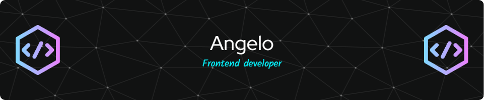

  
  

### 
Apasionado por el desarrollo frontend
  

- 🌱 Siempre busco aprender algo nuevo y mejorar mis habilidades, enfocándome en escribir código limpio y eficiente.  

- 🎨 Me encanta trabajar en el desarrollo frontend, creando interfaces modernas y atractivas.

- ❓ Siempre estoy en constante aprendizaje, explorando y perfeccionando mis habilidades.
  

   

## Mis conocimientos  
<table><tr><td valign="top" width="33%">

### Frontend  

  
  
  
  
  
  
  
  

</td><td valign="top" width="33%">

### Backend  

  
  
  
  
  
  

</td><td valign="top" width="33%">

### Complementario  

  
  

</td></tr></table>  

